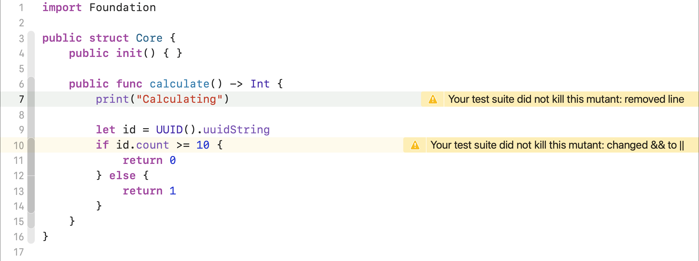

[](https://swift.org/download/)

[](https://app.bitrise.io/app/6354dbc8bfead01c)


[](https://codecov.io/gh/muter-mutation-testing/muter)


### Automated [mutation testing](https://en.wikipedia.org/wiki/Mutation_testing) for Swift inspired by [Stryker](https://github.com/stryker-mutator/stryker), [PITest](https://github.com/hcoles/pitest), and [Mull](https://github.com/mull-project/mull).

#### Muter can be run within Xcode
Use this mode to rapidly diagnose areas where you can begin improving your test code

<picture>
  <source media="(prefers-color-scheme: dark)" srcset="./Docs/Images/muter-in-xcode-dark.png">
  
</picture>

#### Muter can be run from the command line
Use this mode to get detailed information about the health and quality of your entire test suite

<!-- 
    asciinema rec muter-cli-output.cast
    agg --theme solarized-light --font-size 40 --cols 100  --speed 1 muter-cli-output.cast muter-light.gif
    agg --theme solarized-dark --font-size 40 --cols 100  --speed 1 muter-cli-output.cast muter-dark.gif
    ffmpeg -i file.gif -pix_fmt yuv420p output.mp4 
-->

<video src="https://github.com/muter-mutation-testing/muter/assets/7672056/52aec46d-16a4-4728-bf95-b68b8bec8f32" type="video/mp4" media="(prefers-color-scheme:light)"></video>
<video src="https://github.com/muter-mutation-testing/muter/assets/7672056/d022fa00-46bd-4b8a-b0d4-53d72c7c73b5" type="video/mp4" media="(prefers-color-scheme:dark)"></video>


#### Muter can be run in your CI
Use this script to easily mutation test your projects incrementally, enabling you to have per-commit updates on how code changes impact the quality of your test suite. Seamlessly connect the output of this CI step into your dashboard or communication channel of choice, or use it as a starting point for thinking about how you want to incrementally test your code.

```sh
muter --files-to-mutate $(echo \"$(git diff --name-only HEAD HEAD~1 | tr '\n' ',')\")
```

## Table of Contents
### Introduction
1. [What Is Muter?](#what-is-muter)
1. [Why Should I Use This?](#why-should-i-use-this)
1. [How Does It Work?](#how-does-it-work)

### Getting Started
1. [Installation](#installation)
1. [Setup](#setup)
1. [Running Muter](#running-muter)
1. [Assumptions](#assumptions)
1. [Best Practices](#best-practices)
1. [FAQs](#faqs)

## What Is Muter?
Muter is a mutation testing utility that is used to help you determine the quality of your test suite.

With Muter, you can make sure your test suite is meeting all your requirements, fails meaningfully and clearly, and remains stable in the face of unexpected or accidental code changes.

If you're interested in checking out more about mutation testing, you can check out [this link](https://en.wikipedia.org/wiki/Mutation_testing).

## Why Should I Use This?

Muter can strengthen your test suite and shine a light on weaknesses that you were unaware existed. It does this by generating a **mutation score** (expanded on below), which will show you both the areas you may want to improve in your test suite, as well as the areas that are performing well. 

Specifically, a mutation score can help you:
- Find gaps in fault coverage from your test suite by identifying missing groups of tests, assertions, or test cases from your test suite
- Determine if you are writing meaningful and effective assertions that withstand different code than what the test was originally written against
- Assess how many tests fail as a result of one code change

## How Does It Work?
Muter will introduce changes to your source code based on the logic contained in your app. The changes introduced by Muter are called **mutants** which it generates using **mutation operators**.

You can view the list of available mutation operators [here](https://github.com/muter-mutation-testing/muter/blob/master/Docs/mutation_operators.md). 

**NOTE**: Muter does all of its work on a complete copy of your codebase, so it's not possible for it to accidentally leave anything behind.

### Mutation Score
A **mutation score** is provided at the end of every run of Muter. The score is the ratio of the number of mutants your test suite killed versus the total number of mutants introduced.

`mutation score = number of mutants killed / total number of mutants`

For example, if your test suite killed 50 mutants of the 75 introduced by Muter, your score would be 67%. A well-engineered test suite should strive to be as close to 100% as possible.

Muter not only provides a mutation score for your entire test suite, but it also generates individual scores for the files it has mutated.

If you're curious about how a mutation score is different than test code coverage, then check out [this document](https://github.com/muter-mutation-testing/muter/blob/master/Docs/mutation_score_vs_test_code_coverage.md).

## Installation
Muter is available through [Homebrew](https://brew.sh/). Run the following command to install Muter:

```sh
brew install muter-mutation-testing/formulae/muter
```

### Building From Source
You can build Muter from source, and get the latest set of features/improvements, by running the following: 

```sh
git clone https://github.com/muter-mutation-testing/muter.git
cd muter
make install
```

If you've already installed Muter via homebrew, this will install over it. If you've done this, and want to go back to the latest version you've downloaded through homebrew, run the following: 

```sh
make uninstall
brew link muter
```

## Development
If you want to run Muter in Xcode, change the `FileManager` current path (in `main.swift`) to point to the directory containing the project you'd like to test using Muter:

```swift
import Foundation

FileManager.default.changeCurrentDirectoryPath("/some/path")
```
Now you can run Muter from Xcode.

*Note: To pass arguments on launch, you can use Xcode's Scheme Editor and add them.*

## Setup
### Muter's Configuration
To get started using Muter, run `muter init` in the root of your project directory. Muter will take its best guess at a configuration that will work for your project. Muter supports generating configurations for the following build systems:
* Xcode Projects & Workspace
* Swift Package Manager

It saves its configuration into a file named `muter.conf.yml`, which you should keep in the root directory of your project. You should version control your configuration file as well. 

After running `muter init`, you should look at the generated configuration and ensure that it will run your project. We recommend trying the settings it generates in your terminal, and verifying those commands run your tests.

Should you need to modify any of the options, you can use the list below to understand what each configuration option does.

### [Configuration Options](#configuration-options)
- `executable` - the absolute path to the program which can run your test suite (like `xcodebuild`, `swift`, `fastlane`, `make`, etc.)
- `arguments` - any command line arguments the executable needs to run your test suite
- `exclude` - a list of paths, file extensions, or names you want Muter to ignore. By default, Muter ignores all non-Swift files, and any paths containing the following phrases:
    * `/.build/`
    * `/.framework/`
    * `/.swiftdep/`
    * `/.swiftmodule/`
    * `/Build/`
    * `/Carthage/`
    * `/muter_tmp/`
    * `/Pods/`
    * `/Spec/`
    * `/Tests/`
    * `Tests.swift`
    * `/Package.swift`

    The `exclude` option is optional.
    
    **NOTE**: Muter uses a substring match to determine if a file should be excluded from mutation testing. You should not use glob expressions (like `**/*Model.swift`) or regex.

- `excludeCalls` - a list of function names you want Muter to ignore in the [Remove Side Effects](https://github.com/muter-mutation-testing/muter/blob/master/Docs/mutation_operators.md) mutation operator, such as custom logging functions. Mutants in which these functions aren't called will not be created (note that mutations within the functions themselves are *not* skipped, only calls to those functions).

    **NOTE**: Doesn't support overloading currently - all function calls with a matching name will be skipped. 
    
- `coverageThreshold` - when present Muter will ignore files that have a coverage value less than this option.

Below is an example pulled directly from the `ExampleApp` project.
The configuration file will end up looking something like this:
```yaml
arguments:
- -project
- ExampleApp.xcodeproj
- -scheme
- ExampleApp
- -sdk
- iphonesimulator
- -destination
- platform=iOS Simulator,name=iPhone 8
- test
executable: /usr/bin/xcodebuild
exclude:
- AppDelegate.swift
```

Check out the `muter.conf.yml` in the root directory of this repository for another example.

### Xcode Setup
After creating your configuration:

1) **Add a run script step** to the build target.
2) **Add the Muter Xcode command** to the build step:

```sh
muter --format xcode
```

## Running Muter

### From the command line

Once you've created your configuration file, run `muter` in your terminal from any directory of the project you're mutation testing. Muter will take it from there. 

**Available Subcommands**

```
init                    Creates the configuration file that Muter uses
run (default)           Performs mutation testing for the Swift project contained within the current directory.
run-without-mutating    Performs mutation testing using the test plan.
mutate-without-running  Mutates the source code and outputs the test plan as JSON.
operator                Describes a given mutation operator.
```
Muter defaults to `run` when you don't specify any subcommands

**Available Flags**

```
--files-to-mutate       Only mutate a given list of source code files (Supports glob expressions like Sources/**/*.swift)
--skip-coverage         Skips the step in which Muter runs your project to filter out files without coverage.
-o, --output <output>   Output file for the report to be saved.
--operators <operators> The list of mutant operators to be used: RelationalOperatorReplacement, RemoveSideEffects, ChangeLogicalConnector, SwapTernary
--skip-update-check     Skips the step in which Muter checks for newer versions.
-c, --configuration     The path to the muter configuration file.
```

**Using Muter's test plan**

Mutant schemata is a trickly operation because the operators only deals with the source code AST (abstract syntax tree), there is not type inference.
Ending up with a mutated project that does not compile is pretty common.
To circumvent this issue, we recommend using both `mutate-wihtout-running` and `run-without-mutating`.
The command `mutate-wihtout-running` will perform discover mutation points, apply it and save a JSON file named `muter-mappings.json`.
In case the mutated project is not compiling you can fix all of the compilation issues (in our experience they are as simple as indentation issue or even an space that is missing) and re-run muter using `run-without-mutating`, passing the test plan JSON as a parameter.

**Available Report Formats**

```
plain: (default) prints the report to stdout.
json: prints the report in JSON format.
html: prints an HTML report.
xcode: prints mutation test results in real-time, as they are produced, in a format that Xcode can use to report them in the Issue Navigator.
```
Note: If you pass `--output` muter will save the report, instead of using stdout.

**Operators documentation**

For more details on how any mutation operator works, use the `muter operator` command.

To print all of the available operators, use `muter operator all`.

### Within Xcode
Build (Cmd + B) your aggregate build target and let Muter run. The mutants that survive testing will be called out in the issue navigator. Once the target finishes building, testing is completed.

### [Disable muter in code](#disable-muter-in-code)
Muter will ignore code inside a `disable` block, up until you turn it on again by using the `enable` directive or EOF (end-of-file).

```swift
// muter:disable
func f() {
    functionA()
}

// muter:enable
func f() {
    functionB()
}
```

## Mutant Schemata

Muter uses a technique called mutant schemata. This builds a copy of your code with all known mutations inserted at once, but they are disabled by flags. Then your tests are run repeatedly, activating a different mutant each time via environment variables. This is a huge win performance, but comes with a caveat:

Mutations cannot be applied in methods that are annotated with the `@resultBuilder` because some require an implicit return statement, for example:

```swift
@ViewBuilder
func computeView() -> some View {
    if ProcessInfo.processInfo.environment["id"] != nil {
        return a && b ? Color.blue : Color.red
    } else {
        return a && b ? Color.red : Color.blue
    }
}
```

Because result builders do not require an implicit return statement, when Muter tries to add it, the code does not compile.

To circumvent this, you can either ignore the whole file using an `exclude` entry on the [muter configuration file](#configuration-options), or [temporarily disable Muter in code](#disable-muter-in-code).

In case Muter fails to run due to a compilation error, you can assess the mutated project under the `_mutated` folder in the root folder of the project.

**NOTE**: This limitation may not affect you if you are using Swift 5.9+.

## Assumptions

- Muter assumes you always put spaces around your operators. For example, it expects an equality check to look like

    `a == b (Muter will mutate this)`

    not like:

    `a==b (Muter won't mutate this)`
- Muter assumes you aren't putting multiple expressions on one line (and we have the opinion you shouldn't be doing this anyway). Basically, if you aren't using semicolons in your code then Muter shouldn't have an issue mutating it.

## Best Practices
- Commit your `muter.conf.yml`
- It's possible for Muter to cause compile time warnings. As a result of this, we recommend you don't treat Swift warnings as errors while mutation testing by adding the argument `SWIFT_TREAT_WARNINGS_AS_ERRORS=NO` to your `muter.conf.yml` if you're using `xcodebuild`.
- Disable or relax linting rules that would cause a build error as a consequence of a code change not matching your project's style. Muter operates on your source code and then rebuilds it, and the change it introduces could trigger your linter if it's part of your build process.
- Running Muter can be a lengthy process, so be sure to allocate enough time for the test to finish.
- Because Muter can take a while to run, it is recommended to exclude UI or journey tests from your test suite. We recommend creating separate schemes or targets for mutation testing. However, you should feel free to run these kinds of tests if you're okay with the longer feedback cycle.
- Don’t be dogmatic about your mutation score - in practice, 100% is not always possible.

## Example Test Report
There's an example of [the test report that Muter generates](./Docs/test_report_json_example.md) hosted in this repository.

Check out this example to familiarize yourself with what a report looks like.

## FAQs
**What platforms does Muter support?**

Muter supports any platform that compiles and tests using `xcodebuild`, which includes iOS, macOS, tvOS, and watchOS. 

Muter can run only on macOS 10.15 or higher.

**Does Muter support UI test suites?**

Yes! Muter supports any kind of test target or test suite, provided your application code is written in Swift. 

However, UI test suites can be very lengthy, and mutation testing can take a long time. I recommend you start using Muter only on your unit tests. Once you have a feel for interpreting mutation scores, you can then ease into incorporating your longer-running tests.

**Does Muter support Objective-C?**

No, not at this time. Objective-C support may come at a later time. Until then, Muter only supports Swift code. Any bridging code that's written in Swift, but ultimately calls down to Objective-C, is compatible with Muter.

**Is Muter self-hosted?**

Yes! Very early on I made the decision to make sure that Muter was able to provide insight into its development and test suite. After all, since Muter is providing a form of automated testing, it must be as thorough and robust as possible. :P

**This is all pretty cool, but I'm nervous about running this on my own code. I mean, you're putting bugs into my work, and how do I know you're not stealing my source code?**

This is an understandable concern. If you would like to get a feel for what mutation testing is like, and how Muter performs it, I recommend cloning this repository, installing Muter, and then running Muter on the included example project and Muter itself.

Additionally, because Muter is parsing, analyzing, and modifying your source code, a decision was made to give it no network access - Muter collects no analytics, and never phones home. Feel free to look at its source code if you have concerns about this, or open an issue if you would like to have a discussion.

And lastly, make sure you look at and follow Muter's best practices to ensure the best possible experience while using Muter.
